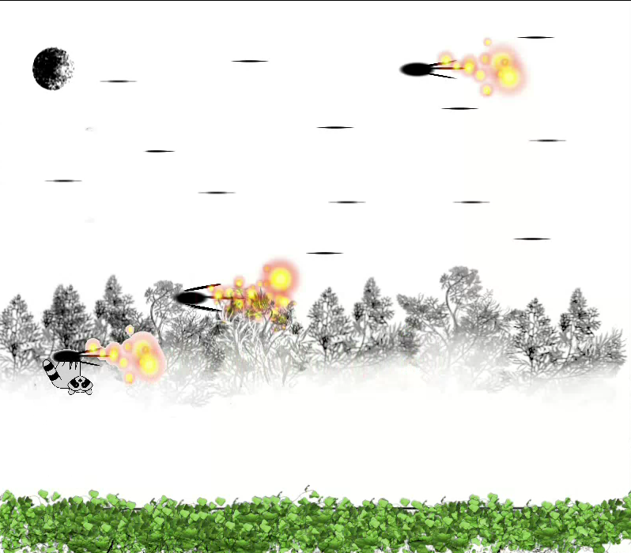
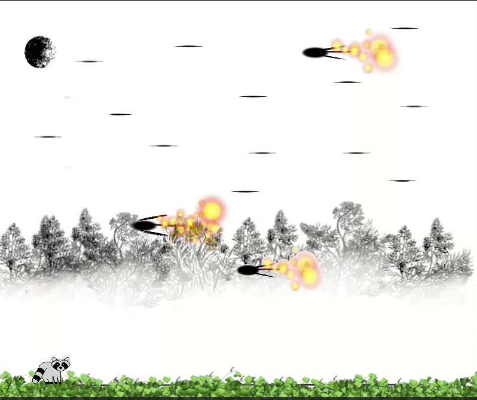

# 🦝 Raccoon Game

A fun 2D platformer-in-progress where you play as a raccoon that can **jump** and **flip upside down** on passing spaceships. Built with **Python + Pygame** and custom-designed assets.  

This project is both a **personal game experiment** and a **demo of my coding skills** — Feel free to explore the code, run the game locally, and follow along with future updates.

---

## 🎮 Gameplay

- Control a raccoon character on a 2D platform with a custom background.  
- Jump with the **spacebar** and land on a moving spaceship.  
- When the raccoon lands on the spaceship’s path, it **flips upside down**.  
- Drop back down with **down arrow**.  
- Reset the game anytime with **Z**.  

*(More mechanics will be added soon — see Roadmap below!)*

---

## 🛠️ Tech Stack

- **Language:** Python 3  
- **Game Engine/Library:** [Pygame](https://www.pygame.org/)  
- **Graphics:** Custom-designed raccoon, spaceship, and background assets  
- **Platform:** Desktop (Windows, Linux, MacOS)  

---

## 🚀 Installation & Usage

1. Clone the repository:
   ```bash
   git clone https://github.com/gabrielwaters-create/racoon-game.git
   cd racoon-game
   ```

2. Install dependencies (make sure you have Python 3 installed):
   ```bash
   pip install pygame
   ```

3. Run the game:
   ```bash
   python racoon-game-good.py
   ```

---

## 📸 Screenshots

Here are a couple of in-game shots:

  


---

## 🗺️ Roadmap / Future Plans

- [ ] Add scoring system  
- [ ] Introduce enemies (wild animals, obstacles)  
- [ ] Multiple levels with increasing difficulty  
- [ ] Background music and sound effects  
- [ ] Endless mode for survival-style gameplay  

---

## 📜 License

This project is licensed under the **MIT License** — feel free to use, modify, and share with credit.  

---

## 👨‍💻 About Me
  
- 💼 LinkedIn: [http://www.linkedin.com/in/gabriel-waters-3a2000300]  

---
